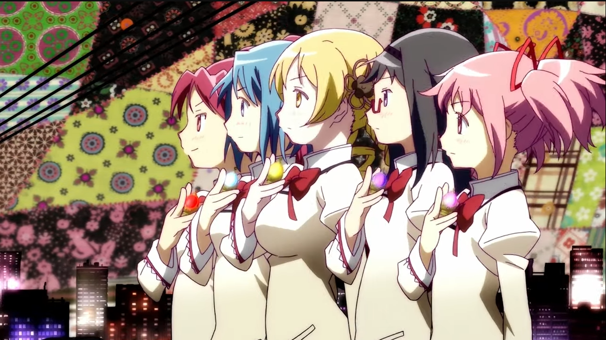
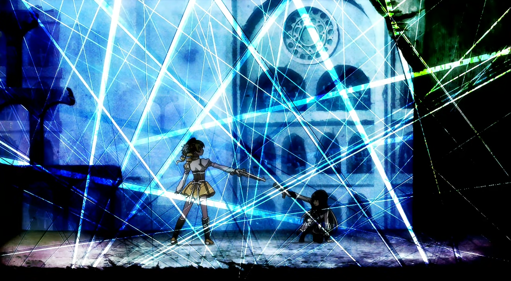
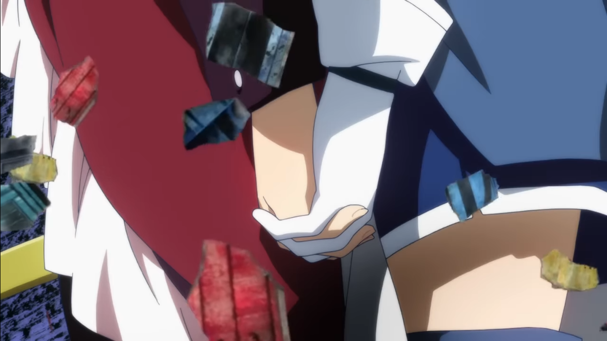
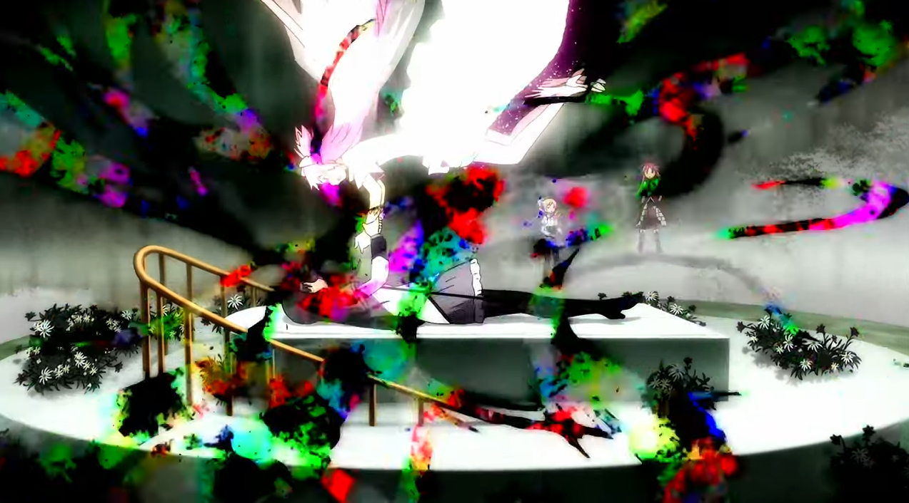

Image source: It's from the official illustrator of Madoka Magica, Aoki Ume, so unfortunately I don't have a URL to give you. But hey, her works are great!

To begin, the proper title is *Puella Magi Madoka Magica the Movie: The Rebellion Story*. If you're interested, the Japanese title is 劇場版 魔法少女まどか☆マギカ［新編］叛逆の物語 (Gekijouban Mahou Shoujo Madoka Magika [Shinpen]: Hangyaku no Monogatari). But I'm just gonna refer to the movie as *Rebellion*.

*Rebellion* is the third Madoka Magica movie. The first and second movies are remakes of the 12 anime episodes, with upgraded graphics and new original soundtracks. *Rebellion* is the sequel to the 12 anime episodes. I could spend 3 hours yapping about why *Rebellion* is amazing and I would still have more stuff to talk about. So no, I ain't gonna do that here. Instead, this blog is a compilation of things that I enjoyed about the movie.

#### 1. Holy Quintet Transformation Sequence

Despite being an anime series about magical girls, there has never been a single transformation sequence up until *Rebellion*. And I got so invested in Madoka Magica that I even forgot that transformation sequence was a thing. When the moive got to the frame you saw above, my brain didn't even register what was about to happen. It was only when the first transformation kicked in that my brain was like "oh... this is what we were supposed to have." It was a surprise, but a *damn pleasant* surprise. The visuals, the color schemes, the animations, the references, they were all just *perfect*. The unique graphics of the series, which I like to call *witch graphics*, made the sequence both alluring and haunting at the same time. Each transformation perfectly captured the essence of each girl. I couldn't have asked for a better transformation sequence. It was just *exquisite*. Holy Quintet/10.

#### 2. Holy Quintet

I would have included music in the previous section, but the music nerd in me said "That ain't how we do things around here. We dedicate a separate section for the music."

*Holy Quintet* is the [soundtrack](https://www.youtube.com/watch?v=LF1ek8uzHZo) played during the Holy Quintet transformation sequence. Perhaps to complement the fact that this is for the *Holy* Quintet, the entire track has a very strong orchestral vibe to it. You know how grandiose orchestral versions are. The track itself is a medley, comprised of orchestral versions of five soundtracks from the 12 episodes. Each track is associated with one girl. *Salve, Terrae Magicae* for Mami, *Venari Strigas* for Kyouko, *Decretum* for Sayaka, *Inevitabilis* for Homura, and *Sagitta Luminis* for Madoka. These tracks aren't character themes per say. Rather, they are strongly associated with each girl in crucial scenes from the 12 episodes. 

- [*Salve, Terrae Magicae*](https://www.youtube.com/watch?v=KNckHcB75fY) (Latin for *Welcome to a magical world*) was played when Mami first appeared to save Madoka and Sayaka from a witch, which was also the first time we saw a magical girl in the series. I know that Mami is usually associated with [*Credens Justitiam*](https://www.youtube.com/watch?v=A_J3UhPK-Zo) (Latin for *Believe in justice*), but *Salve, Terrae Magicae* works better as an opening. I also did not recognize that it was *Salve, Terrae Magicae* when Mami was transforming. Shame on me.

- [*Venari Strigas*](https://www.youtube.com/watch?v=Z77ZLwZY2Ao) (Latin for *Witch hunt*) was played when Kyouko first appeared to hunt down a witch. Its dark and serious tone very much befitted Kyouko, who was introduced as a senior magical girl who only cared about hunting down witches, and would do *anything* to obtain Grief Seeds. The orchestral remix maintained more or less the same vibe, but it sounded much more grandiose.

- [*Decretum*](https://www.youtube.com/watch?v=XeMVu1OYYps) (Latin for *Decision*) was played when Sayaka fell to the bottom of her despair and turned into a witch. The track was filled with sorrow and regrets, which made the choice of the word *decretum* rather harrowing. It was also the first time we learned the truth about the fate of magical girls. So this track *haunted everyone*. The orchestral version maintained the leitmotif, but now filled it with hope instead. God it was so beautiful. *Decretum* was also beautiful, but haunting at the same time.

- [*Inevitabilis*](https://www.youtube.com/watch?v=E-_cHAvCar8) (Latin for *Inevitable*) could actually be considered Homura's theme, since it was played almost everytime she made an appearance in the 12 episodes. The title itself is very self-explanatory in case you haven't realized that. The track was filled with a sense of emptiness of hopelessness, which perfectly described Homura's desparate journey to save Madoka. The remix kept the leitmotif and filled it with hope, which resulted in a sense of mystery. Which also perfectly described Homura; from the perspectives of other girls, Homura was indeed a very mysterious person.

- [*Sagitta Luminis*](https://www.youtube.com/watch?v=jJX3D8Gk1t0) (Latin for *Arrow of light*) was played when Madoka made her wish and became a goddess to save all magical girls. The title referred to her unique magical girl power, the ability to shoot arrows made from light. The track was both hopeful and solemn at the same time, which perfectly described how we felt when we saw Madoka became a goddess: she saved everyone, at the cost of removing herself from existence. It was one of those "we've won, but at what cost?" moment, and it was beautifully expressed. The orchestral mix kept the melody and removed the solemn part, making it sound more like your typical magical girl theme. It was beautiful nonetheless.

Don't ask me why the original soundtracks were titled in Latin. Just know that I decided to give myself a crash course on Latin and that was a horrible idea.

#### 3. Homura vs Mami

The first battle ever between two magical girls and I must say, Studio Shaft *delivered*. You could see every action very clearly in each frame, despite the numerous amount of bullets rendered in the fight sequence. The fight kept transitioning between Homura and Mami, but the transitions were very smooth and timed perfectly to increase the tension of the fight. And then we have the face-to-face fighting sequence, where each girl fired shots at each other, *point-blank*. Again, the transitions were exquisite, they perfectly captured the tension, and I really loved how the animators varied the way each girl countered the point-blank shots. And that last stand-off where time started moving again and bullets flew everywhere destroying the surroundings, yet the two girls stood perfectly still with a gun at each other's throat? It was nothing short of an artistic masterpiece. Absolute Configuration/10.

#### 4. Absolute Configuration

Welcome to another music section. You should be expecting this kind of thing at this point tbh.

*Absolute Configuration* is the [soundtrack](https://www.youtube.com/watch?v=b1xyLNp24s8) played during the Homura vs Mami sequence. If you know Kajiura Yuki, the composer for the Madoka Magica series, then you probably first know her as the composer of the Sword Art Online anime series. You know how amazing those battle themes in SAO are (I'm looking at you, *Swordland* and *Luminous Sword*). *Absolute Configuration* is of that same caliber. I do not need to say more. This track just blends so well with the fighting sequence.

#### 5. Noi!

*Noi!* is the [theme](https://www.youtube.com/watch?v=7YwH3yYIkJ4) of Homulily, the Nutcracker Witch, the witch form of Homura. The lyrics is written in broken German, as someone has pointed out under the YouTube comment section. I don't know shit about German, so I have no commentaries there. All I know is that the track is damn good. Very cool witch music. We should probably petition for more witch music. We don't have enough of those. And tbh, does being grammatically correct matter that much if it already complements the melody so damn well?

#### 6. Kyouko and Sayaka

Instead of telling you how much I love this reunion scene of Kyouko and Sayaka, I will let the transcript do that job for me.

<blockquote>
"I had a sickening dream."  
"A dream where you were dead."  
"But you're saying that was reality, and this right here, when we're fighting side by side, is just a dream, Sayaka?"  
"This isn't just a dream. It's a little brighter than that."  
"I thought I didn't have any regrets when I died."  
"But the reason I ended up taking this assignment and coming back, was because I actually do have one regret."  
"The fact that I left you behind."  
</blockquote>

And then the animators proceeded to grant us an amazing team-up of Kyouko and Sayaka.

You really don't need to say "I love you" to tell someone that you love them.

#### 7. We're here for you

*We're here for you* is the [soundtrack](https://www.youtube.com/watch?v=PVeyUTawPwQ) played when everyone teamed up to save Homura from the Nutcracker Witch (and get rid of the goddamn Kyubeys at the same time). One of the few soundtracks of the series, if not the only one, to be completely filled with hope. This was also the third evolution of the leitmotif found in *Sis Puella Magica* (Latin for *Be a magical girl*) and *Decretum*. Even when I didn't consciously realize the leitmotif when I first heard it, the leitmotif was already etched so deep within my subconsciousness that this supposedly brand new soundtrack just activated all of my neurons. I later also figured out that the encore part of this track was used at the ending theme for the first and second movies, titled *For the next episode*. Talk about foreshadowing.

#### 8. Devil Homura

Homura went through endless pain and suffering to save Madoka. But Madoka decided to become a goddess for everyone's sake. Homura failed to save Madoka. Homura fell into despair and became a witch. Everyone teamed up to save Homura from the Nutcracker Witch. Homura returned as a magical girl and Madoka decided to take her to the heavens.

You know that feeling when your world view changes significantly, usually for the worse, after you have experienced extremely negative conditions, whether physically or psychologically, and come out of that, still alive? This is exactly what is happening here.

Homura fell into despair and came back. Her view became extremely twisted. She decided to do *whatever* it takes to save Madoka, even if it meant trampling Madoka's wish. She stole a portion of Madoka's power as a goddess and separate the girl from the goddess. With that power, she rewrote the entire universe and gave everyone a happy life. The entire sequence where the universe was being rewritten was nothing short of an artistic masterpiece. Homura's expressions were nothing short of a true devil. And of course,

> "Warmer than hope, far deeper than despair. That is love."

The best quote of love ever. Change my mind.

#### 9. I was waiting for this moment

*I was waiting for this moment* is the [soundtrack](https://www.youtube.com/watch?v=r_hwT_uAxc0) played when Homura decided to become the devil and rebelled against the goddess. The percussions at the beginning indicates that something is not right, and as the track goes on, violins were added, violins became more intense, the vocals became more passionate. It accompanied the entire sequence so damn well. Devil Homura/10.

#### 10. Mada Dame Yo

*Mada Dame Yo* is an [insert song](https://www.youtube.com/watch?v=u_BXFfQhSDk) that serves as the leitmotif of the entire movie. It captures the entirety of Homura's emotional state, which is at the center of the entire movie. It is extremely short as a soundtrack. It is extremely impactful as a leitmotif. Not Yet/10.

#### Final Notes

I somehow managed to make this a Top 10 compilation despite not giving a crap about how long this post was gonna be. Anyways, the fourth movie, *Walpurgisnacht Rising*, is scheduled to be released in February 2026. I'm in Canada, and February is the worst time possible for winter. **But**. If the movie makes its way to North America, you can be damn sure I ain't gonna give a crap about my horrible winter tolerance.