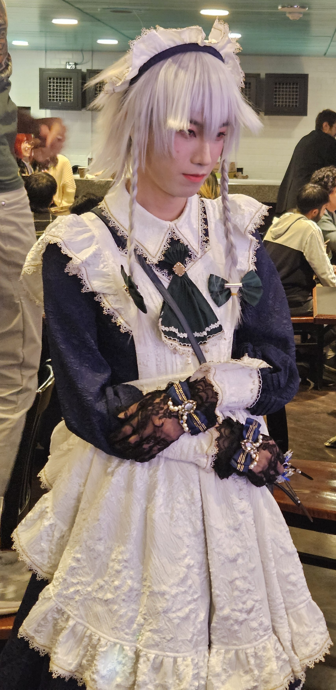

Image source: https://www.instagram.com/p/DQH9bvwEWev/?utm_source=ig_web_copy_link&igsh=MzRlODBiNWFlZA==.

So aside from End of Term concerts, Animusic Club also hosts these maid cafes, once every term. It's a cafe, where you get your food and drinks served by fellow students wearing maid costumes, and you listen to live music performed by the club's band. They also sell a bunch of merch and you can buy them to support the club. There are cosplayers going around the cafe as well, they get free drinks and you get to take photos of them.

That being said, the cafe hosted just 2 days ago was the very first one I attended. Despite the fact that I have been going to their concerts ever since my first term at Waterloo. While I'd like to say that fall and winter weather suck ass (which is true), it honestly is less about that and more about me being too introverted to show my face to the maid cafe all alone.

And this term was supposed to be the same, I was supposed to stay at home and do nothing. But for whatever reasons, I decided to do a fun little thing to give me some motivation to drag my ass out in the 5 degrees Celsius weather to the maid cafe. I made a bet with my friend: if I go to the cafe and see a cosplayer from either *Touhou Project* or *Madoka Magica*, he gets 10 CAD.

And that was how you got this review post today about the maid cafe.

#### 1. Location

My ignorant ass didn't realize that the Student Life Center at my school has a whole area where you can turn it into a cafe of your own design should you choose to, until now. Think of it as the base template of a cafe. I was quite surprised to see that it does have the size of a typical cafe. So basically there was about enough space for every activity, and I didn't have to cramp my way into the cafe, or trip on any wire. Pretty nice place.

#### 2. Food and Drinks

The menu honestly could use some improvements. I ordered a date cake and a cup of green tea, 4 bucks in total. I didn't expect the date cake to be the size of a Samsung Galaxy charger brick, given that I paid 2 bucks for the cake alone. And uh, the cake quality could also use some improvements. I didn't really have any complaints about the green tea, mostly because I don't really drink tea. Though, I learned 2 things. One, probably shouldn't have ordered tea when there were non-tea options. My cat tongue got burned quite thoroughly. Second, probably shouldn't have drunk tea at 7PM on an empty stomach. Did not go very well for my stomach.

#### 3. Maids

Interestingly enough, there weren't any maid uniform, as long as the outfits the maids were wearing qualified as maid outfits. To my somewhat of a surprise, half the maids there were dudes. To my utmost surprise, all those dudes wore the maid garter on their thighs. A rather blursed sight, if you ask me. Maid service was pretty nice, I had no complaints about that area.

#### 4. Live music

As always, I was pleased with the live music. Very pleasant to listen to, and very suiting for a maid cafe. I enjoyed the atmosphere there very much. Great way to relax my mind. Too bad I had to leave at 8PM for my dinner. Probably should have had early dinner.

#### 5. Cosplayers

There were around 10 cosplayers or so during the 2 hours of my tenure. All the cosplays were really nice.

And I lost my goddamn bet. Izayoi Sakuya from *Touhou Project* turned up in the most stunning way possible and I got stunlocked for some 20 minutes. Not that I'm complaining about my 10 bucks disappearing, the Sakuya cosplay was worth every cent of it. They were so lovely that I managed to kick my introverted self out of the way for a grand total of 30 seconds just to get a close-up shot of Sakuya.

And I didn't have the balls to ask for their contact info, or even do a selfie, which was what most people there did when they saw Sakuya. Yeah, maybe I should grow a spine next time.

Oh yeah, here's the photo I took of Sakuya.

Never thought the camera on my new phone would be useful like this.

Stunning, gracious, lovely cosplay. 10/10.